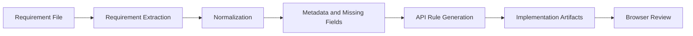
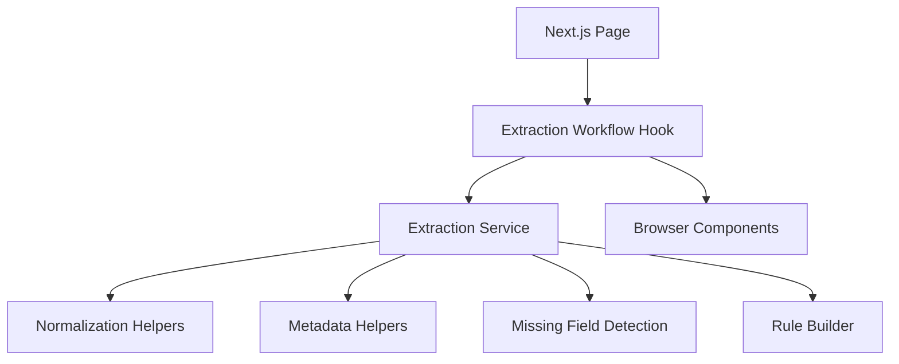
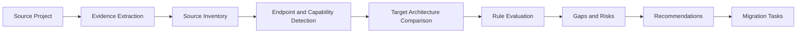
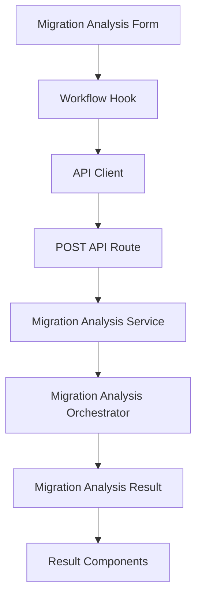
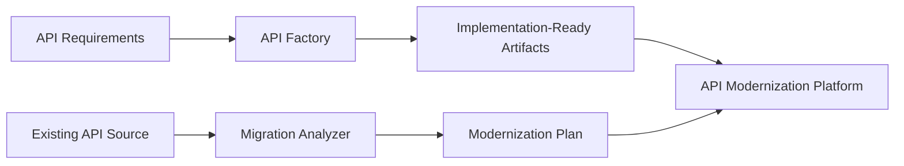

# Day 48 — Phase 1: Documentation and Portfolio Packaging Plan

## 1. Phase Overview

Day 48 converts the two technical projects completed during the 50-Day Roadmap into clear, professional, recruiter-ready portfolio assets.

The projects in scope are:

```text
Project 1 — AI-Assisted API Factory
Project 2 — API Migration Analyzer
```

The purpose of this phase is not to add major technical features. The purpose is to make the completed engineering work easy to understand, evaluate, demonstrate, and discuss.

Recommended file location:

```text
docs/day48/documentation_portfolio_plan.md
```

---

## 2. Primary Objective

Create a consistent documentation and presentation package that allows a recruiter, engineering manager, architect, or interviewer to understand:

* The problem each project solves
* The users and workflows supported
* The system architecture
* The most important engineering decisions
* The technologies used
* The testing and validation strategy
* The business and technical value
* The current project limitations
* The future development opportunities
* The relationship between both projects

The documentation should support:

```text
GitHub repository review
Resume screening
Recruiter conversations
Technical interviews
System-design discussions
LinkedIn publication
Research-paper preparation
Personal portfolio presentation
```

---

## 3. Projects in Scope

## 3.1 Project 1 — AI-Assisted API Factory

### Core purpose

The API Factory converts unstructured API requirements into structured, implementation-ready engineering artifacts.

### Primary workflow

```text
Requirement file
    ↓
Requirement extraction
    ↓
Requirement normalization
    ↓
Missing-field identification
    ↓
API rule generation
    ↓
Implementation planning
    ↓
Browser review
```

### Primary portfolio message

> The API Factory reduces the manual effort required to interpret inconsistent API requirements by converting source documents into structured, traceable, and implementation-ready outputs.

### Important capabilities to document

* Requirement-file input
* Deterministic requirement extraction
* Requirement normalization
* Missing-field detection
* Flow-name extraction
* Rule construction
* Extraction metadata
* Browser workflow state
* Reset and rerun behavior
* Type-safe frontend architecture
* Unit and component validation
* Production build validation

---

## 3.2 Project 2 — API Migration Analyzer

### Core purpose

The API Migration Analyzer examines an existing API source project, compares it with a selected target architecture, and generates an actionable modernization plan.

### Primary workflow

```text
Source project
    ↓
Evidence extraction
    ↓
Source inventory
    ↓
Endpoint and capability detection
    ↓
Target-architecture comparison
    ↓
Rule evaluation
    ↓
Migration gaps
    ↓
Migration risks
    ↓
Recommendations
    ↓
Migration tasks
```

### Primary portfolio message

> The Migration Analyzer transforms source-code evidence into an explainable modernization assessment containing architecture scores, rule results, gaps, risks, recommendations, and sequenced migration tasks.

### Important capabilities to document

* Sample-project selection
* Target-architecture selection
* Request construction
* Server-side analysis execution
* Evidence extraction
* Endpoint detection
* Capability detection
* Rule evaluation
* Gap generation
* Risk generation
* Recommendation generation
* Migration-task generation
* Summary scorecards
* Evidence viewer
* Error recovery
* Reset and rerun behavior
* Vitest validation
* Production build validation

---

## 4. Combined Portfolio Positioning

The two projects should be positioned as related parts of an **AI-Assisted API Modernization Platform**.

```text
API Factory
Transforms requirements into implementation-ready API artifacts
        +
Migration Analyzer
Transforms existing source systems into modernization plans
        =
AI-Assisted API Modernization Platform
```

### Combined problem statement

Organizations often modernize APIs through two separate workflows:

1. Building new APIs from incomplete or inconsistent requirements
2. Migrating existing APIs toward modern target architectures

Both workflows require engineers to manually inspect documents, source code, dependencies, architecture expectations, risks, and implementation gaps.

The combined platform demonstrates how structured analysis can support both workflows.

### Combined value proposition

```text
Requirement understanding
        ↓
Implementation preparation
        ↓
Existing-system analysis
        ↓
Architecture comparison
        ↓
Migration planning
```

The portfolio should make clear that these are two independent projects connected through one modernization vision.

---

## 5. Target Readers

Documentation must be written for multiple reader types.

## 5.1 Recruiters

Recruiters need to understand the project within approximately 30 seconds.

They should quickly see:

* The problem
* The solution
* The technologies
* The scale or complexity
* The engineering value
* The project status

Avoid starting the README with detailed implementation internals.

---

## 5.2 Engineering Managers

Engineering managers need to understand:

* What was built
* Why the architecture was selected
* How responsibilities were separated
* How the project was tested
* Whether the work demonstrates production-oriented thinking
* What tradeoffs remain

---

## 5.3 Software Engineers

Engineers need:

* Project structure
* Setup instructions
* Core data flow
* Important interfaces
* Test commands
* Technical limitations
* Extension points

---

## 5.4 Architects

Architects need:

* System boundaries
* Client/server separation
* Domain workflow
* Evidence traceability
* Rule evaluation process
* Target-architecture modeling
* Tradeoffs and scalability considerations

---

## 5.5 Interviewers

Interviewers need material that supports discussion of:

* System design
* API design
* State management
* Test strategy
* Error handling
* Modularity
* Migration planning
* Architecture tradeoffs
* Future scaling

---

## 6. Documentation Principles

All Day 48 documentation should follow these principles.

### 6.1 Lead with the problem

Every README should first answer:

```text
What problem does this project solve?
```

Do not start with installation commands or directory trees.

### 6.2 Explain the outcome

The documentation should show what the system produces.

For example:

```text
Structured requirements
Missing-field reports
Migration scorecards
Rule results
Gap reports
Risk reports
Recommendations
Migration tasks
Evidence traces
```

### 6.3 Separate current functionality from future plans

Use clear sections for:

```text
Implemented
Known limitations
Future improvements
```

Do not describe future plans as completed functionality.

### 6.4 Use accurate validation language

For the API Migration Analyzer, use:

```text
Vitest validation: Implemented
TypeScript validation: Implemented
Production build validation: Implemented
Playwright E2E validation: Deferred
```

Do not claim that Playwright passed.

### 6.5 Avoid confidential information

Do not include:

* Macy’s internal source code
* Client-specific business requirements
* Internal URLs
* API credentials
* Tokens
* Certificates
* Proprietary database names
* Customer information
* Employee information
* Internal screenshots
* Production request or response payloads

Use sanitized sample projects and generic examples.

### 6.6 Make documentation reproducible

Every setup and validation command must be executable from the documented project directory.

### 6.7 Prefer evidence over claims

Instead of writing:

```text
The application is highly tested.
```

Write:

```text
The project includes unit, domain, hook, and component tests executed with Vitest.
```

When final counts are available, include the actual passing test count.

---

## 7. Required Day 48 Deliverables

Day 48 should produce the following documentation assets.

```text
docs/day48/documentation_portfolio_plan.md
README.md for the API Migration Analyzer
Reviewed README.md for the API Factory
docs/architecture/api_factory_architecture.md
docs/architecture/migration_analyzer_architecture.md
docs/day48/screenshot_demo_checklist.md
docs/day48/portfolio_project_summaries.md
docs/day48/day48_completion_report.md
```

Optional assets include:

```text
docs/images/
portfolio/
demo/
```

The exact directories may differ, but the responsibilities should remain organized.

---

## 8. README Strategy

Each project README should follow a consistent high-level format.

```text
1. Project title
2. One-sentence value proposition
3. Project status
4. Problem statement
5. Solution overview
6. Core features
7. User workflow
8. Architecture
9. Technology stack
10. Project structure
11. Installation
12. Local execution
13. Testing
14. Example output
15. Engineering decisions
16. Known limitations
17. Future improvements
18. Portfolio and interview summary
```

The README should be detailed enough for technical evaluation but structured so readers can skim it.

---

## 9. API Factory README Requirements

The API Factory README must include the following sections.

## 9.1 Project overview

Explain that the application converts unstructured API requirements into structured engineering artifacts.

## 9.2 Problem statement

Document the difficulty of interpreting:

* Inconsistent requirements
* Missing fields
* Unstructured files
* Ambiguous API behavior
* Repeated manual analysis

## 9.3 Solution

Describe how the project performs:

* Extraction
* Normalization
* Validation
* Missing-information detection
* Rule generation
* Browser presentation

## 9.4 Core workflow

Include:

```text
Requirement file
    ↓
Raw extraction
    ↓
Normalized extraction
    ↓
Metadata
    ↓
Missing fields
    ↓
Generated rules
```

## 9.5 Architecture

Explain the role of:

* Next.js page
* Workflow hook
* Extraction helpers
* Shared types
* Domain rules
* Browser components
* Validation tests

## 9.6 Testing

Document:

* Lint
* TypeScript
* Vitest
* Production build
* Any deferred testing honestly

## 9.7 Demonstration

Show a sanitized example of:

```text
Input requirement
Extracted requirement
Missing field
Generated rule
```

---

## 10. Migration Analyzer README Requirements

The Migration Analyzer README must include the following sections.

## 10.1 Project overview

Explain that the project evaluates a source API against a selected target architecture.

## 10.2 Problem statement

Document the difficulty of manually identifying:

* Existing endpoints
* Source capabilities
* Architecture mismatches
* Migration gaps
* Migration risks
* Recommended changes
* Migration sequencing

## 10.3 Solution

Describe the deterministic analysis pipeline.

```text
Source artifacts
    ↓
Evidence extraction
    ↓
Inventory construction
    ↓
Target comparison
    ↓
Rule evaluation
    ↓
Migration outputs
```

## 10.4 Browser workflow

Document:

* Source-project selection
* Target-architecture selection
* Analysis execution
* Loading state
* Results navigation
* Evidence inspection
* Reset and rerun

## 10.5 Client/server boundary

Include:

```text
Migration Analysis Form
    ↓
Workflow Hook
    ↓
API Client
    ↓
Next.js API Route
    ↓
Migration Service
    ↓
Migration Orchestrator
```

Explain that the browser does not execute the orchestrator directly.

## 10.6 Analysis results

Explain:

* Summary
* Scores
* Rule results
* Gaps
* Risks
* Recommendations
* Migration tasks
* Missing information
* Evidence

## 10.7 Testing status

State accurately:

```text
ESLint validation: Included
TypeScript validation: Included
Vitest validation: Included
Production build validation: Included
Production smoke testing: Included
Playwright E2E testing: Deferred
```

## 10.8 Known limitations

Include:

* Predefined sample projects
* Local target architectures
* No persistent analysis history
* No authentication
* No external AI execution required
* Playwright browser validation deferred

---

## 11. Architecture Diagram Plan

Architecture diagrams should be created with Mermaid so they remain version-controlled and editable.

## 11.1 API Factory workflow diagram



## 11.2 API Factory component diagram



## 11.3 Migration Analyzer workflow diagram



## 11.4 Migration Analyzer execution diagram



## 11.5 Combined platform diagram



---

## 12. Screenshot Strategy

Screenshots should demonstrate the user journey rather than only showing static pages.

## 12.1 API Factory screenshots

Capture:

1. Initial requirement-file input
2. Extraction loading state
3. Raw extracted requirements
4. Normalized requirements
5. Extraction metadata
6. Missing fields
7. Generated rules
8. Final completed workflow

## 12.2 Migration Analyzer screenshots

Capture:

1. Initial analyzer form
2. Selected sample project
3. Selected target architecture
4. Loading state
5. Summary scorecards
6. Rule results
7. Migration gaps
8. Migration risks
9. Recommendations
10. Migration tasks
11. Evidence viewer
12. Error state when practical

## 12.3 Screenshot quality rules

* Use consistent browser dimensions.
* Avoid browser bookmarks or personal tabs.
* Use sanitized sample data.
* Use readable zoom.
* Avoid cropped controls.
* Avoid including local usernames when possible.
* Do not include internal company data.
* Use descriptive filenames.

Example:

```text
docs/images/migration-analyzer-summary.png
docs/images/migration-analyzer-risks.png
docs/images/api-factory-normalized-requirements.png
```

---

## 13. Demo Strategy

Each project should have a short repeatable demo.

## 13.1 API Factory demo

Target duration:

```text
2–3 minutes
```

Demo flow:

1. Introduce the requirement problem.
2. Upload or select a sanitized requirement.
3. Run extraction.
4. Show normalized output.
5. Show missing fields.
6. Show generated rules.
7. Explain implementation value.

## 13.2 Migration Analyzer demo

Target duration:

```text
3–4 minutes
```

Demo flow:

1. Introduce the migration-planning problem.
2. Select a sample project.
3. Select a target architecture.
4. Run analysis.
5. Review scorecards.
6. Review one rule result.
7. Review one gap and one risk.
8. Review recommendations and tasks.
9. Open evidence.
10. Explain traceability.

## 13.3 Combined demo

Target duration:

```text
5–7 minutes
```

Combined story:

```text
The API Factory supports building a new API from requirements.

The Migration Analyzer supports modernizing an existing API.

Together, they demonstrate an end-to-end API modernization platform.
```

---

## 14. Portfolio Summary Requirements

Prepare three versions for each project.

## 14.1 Resume version

Use two or three concise achievement-oriented bullets.

The bullets should include:

* What was built
* Technical approach
* Result or value
* Testing or architecture quality

## 14.2 Recruiter version

Target length:

```text
30 seconds
```

Structure:

```text
Problem
Solution
Technology
Value
```

## 14.3 Interview version

Target length:

```text
3–5 minutes
```

Structure:

```text
Problem
Architecture
Workflow
Design decisions
Testing
Challenges
Tradeoffs
Future improvements
```

## 14.4 Deep technical version

Prepare additional detail for:

* State management
* Domain modeling
* Client/server boundaries
* Deterministic analysis
* Rule systems
* Evidence traceability
* Testing strategy
* Error recovery
* Scalability

---

## 15. GitHub Repository Presentation

Each repository should have a clear first-screen presentation.

Recommended top section:

```text
Project name
One-line value proposition
Project status
Technology badges
Architecture image or screenshot
Quick-start commands
```

### Repository description

The GitHub repository description should be one concise sentence.

### Topics

Potential repository topics include:

```text
nextjs
typescript
react
api-modernization
static-analysis
migration-analysis
developer-tools
software-architecture
vitest
api-generation
```

Use only topics that accurately describe the repository.

### Repository hygiene

Review:

* Repository name
* Description
* README
* License
* `.gitignore`
* Screenshots
* Commit history
* Default branch
* Dead files
* Secrets
* Generated folders
* Internal references

---

## 16. Confidentiality and Sanitization Review

Before publishing, search for company-specific and sensitive terms.

Suggested PowerShell review:

```powershell
Get-ChildItem -Path . -Recurse -File |
  Select-String -Pattern `
    "macys|macy's|bloomingdales|zensar|ultra global|apikey|secret|token|password|certificate"
```

Review matches manually. Do not delete legitimate generic code merely because it contains terms such as `token`.

Also inspect:

```text
.env files
Certificates
Private keys
API payload examples
Screenshots
Test fixtures
Git history
Documentation
```

Never commit:

```text
.env
.env.local
*.pem
*.key
*.p12
*.pfx
credentials.json
service-account.json
```

---

## 17. Validation Accuracy Rules

Documentation must reflect actual validation status.

For Project 2, the current approved phrasing is:

```text
Core validation includes ESLint, TypeScript, Vitest, and production build checks.

Playwright end-to-end browser validation is currently deferred and remains a future stabilization task.
```

Do not write:

```text
Fully production validated
Complete desktop, tablet, and mobile E2E coverage
All Playwright tests passed
```

unless those validations are completed later.

---

## 18. Documentation Quality Checklist

### Content

* [ ] Problem statement is clear.
* [ ] Solution is clear.
* [ ] Core workflow is documented.
* [ ] Architecture is documented.
* [ ] Technologies are documented.
* [ ] Setup commands are accurate.
* [ ] Test commands are accurate.
* [ ] Outputs are explained.
* [ ] Limitations are documented.
* [ ] Future improvements are documented.

### Presentation

* [ ] README is easy to scan.
* [ ] Headings are consistent.
* [ ] Long paragraphs are minimized.
* [ ] Code blocks are valid.
* [ ] Diagrams render correctly.
* [ ] Screenshots are readable.
* [ ] Links are valid.
* [ ] No broken image reference remains.

### Accuracy

* [ ] No future feature is described as implemented.
* [ ] No deferred test is described as passing.
* [ ] No unsupported scale claim is included.
* [ ] No unverified performance claim is included.
* [ ] No test count is included without command evidence.

### Confidentiality

* [ ] No credentials are included.
* [ ] No internal URL is included.
* [ ] No company-specific source code is included.
* [ ] No client data is included.
* [ ] No private screenshot is included.
* [ ] No personal file path is unnecessarily shown.

---

## 19. Day 48 Execution Order

Complete Day 48 in this order:

```text
Phase 1
Documentation and portfolio plan
        ↓
Phase 2
Migration Analyzer README
        ↓
Phase 3
API Factory README review
        ↓
Phase 4
Architecture diagrams
        ↓
Phase 5
Screenshot and demo checklist
        ↓
Phase 6
Portfolio and interview summaries
        ↓
Phase 7
Day 48 completion report
```

This order ensures that architecture, screenshots, and summaries are based on the final README positioning.

---

## 20. Out of Scope

The following work is outside Day 48:

* Major feature development
* New migration rules
* New target architectures
* Playwright troubleshooting
* New API Factory workflow behavior
* Authentication
* Database persistence
* Cloud deployment
* Research-paper drafting
* Technical article drafting
* LinkedIn launch copy
* Resume redesign
* Job applications

Critical documentation defects may be fixed, but Day 48 should not reopen stable project architecture.

---

## 21. Day 48 Acceptance Criteria

Day 48 is complete when:

* [ ] Documentation plan is complete.
* [ ] Migration Analyzer README is complete.
* [ ] API Factory README is reviewed and improved.
* [ ] API Factory architecture diagram is complete.
* [ ] Migration Analyzer architecture diagram is complete.
* [ ] Combined platform positioning is documented.
* [ ] Screenshot checklist is complete.
* [ ] Demo workflow is documented.
* [ ] Resume summaries are prepared.
* [ ] Recruiter summaries are prepared.
* [ ] Interview summaries are prepared.
* [ ] GitHub presentation is reviewed.
* [ ] Confidentiality review is complete.
* [ ] Playwright is accurately marked as deferred.
* [ ] Day 48 completion report is prepared.

---

## 22. Phase 1 Completion Status

Day 48 Phase 1 is complete when the documentation strategy, required deliverables, reader expectations, screenshot plan, demo plan, sanitization rules, and acceptance criteria are established.

Phase 1 does not mean both projects are already portfolio-ready.

It means the roadmap is:

```text
READY FOR DOCUMENTATION EXECUTION
```

---

## 23. Expected Day 48 Outcome

At the end of Day 48:

```text
Project 1 — AI-Assisted API Factory
README: COMPLETE
Architecture documentation: COMPLETE
Screenshots: PREPARED
Portfolio summary: COMPLETE

Project 2 — API Migration Analyzer
README: COMPLETE
Architecture documentation: COMPLETE
Screenshots: PREPARED
Portfolio summary: COMPLETE
Core technical validation: DOCUMENTED
Playwright E2E validation: DEFERRED

Combined platform positioning:
COMPLETE

Next roadmap step:
Day 49 — Research Paper, Technical Article, and LinkedIn Package
```
